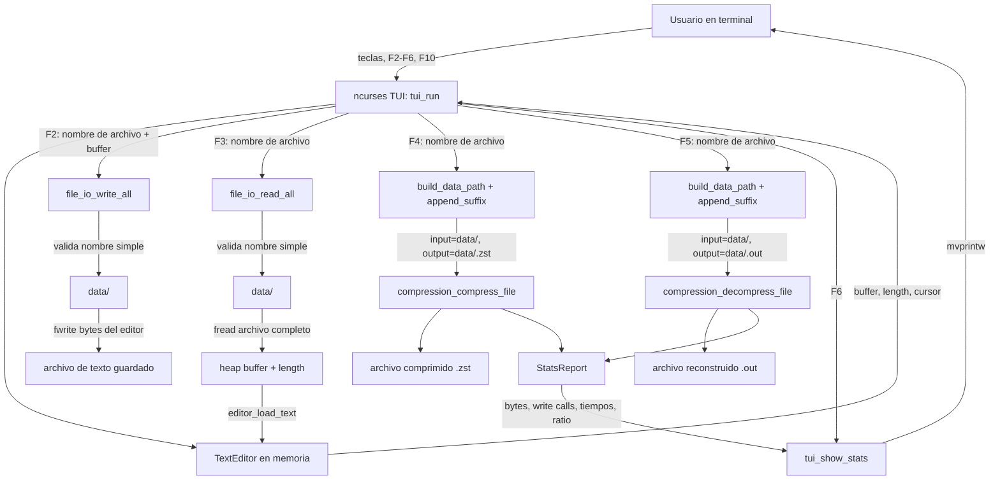
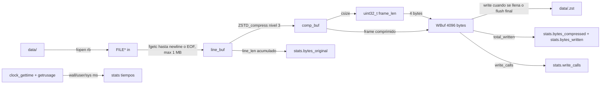
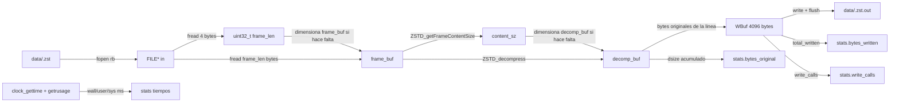

# TUI_Compression - Pipeline I/O de datos



## Pipeline de compresion

Formato de salida por linea:

```text
[uint32_t frame_len][frame Zstd]
[uint32_t frame_len][frame Zstd]
...
```



I/O principal:

| Etapa | Entrada | Transformacion | Salida |
| --- | --- | --- | --- |
| TUI F4 | nombre escrito por usuario | valida que sea nombre simple y fuerza prefijo `data/` | `input_path`, `output_path=.zst` |
| Lectura | `data/<archivo>` | lectura byte a byte hasta `\n`, EOF o 1 MB | `line_buf` |
| Compresion | linea cruda | `ZSTD_compress(..., ZSTD_LEVEL=3)` | frame Zstd |
| Serializacion | frame Zstd | antepone `uint32_t frame_len` | registro binario |
| Escritura | registros binarios | bufferiza en bloques de 4096 bytes | archivo `.zst` |
| Estadisticas | tamanos, llamadas write, reloj | acumula y finaliza ratio | `StatsReport` |

## Pipeline de descompresion



I/O principal:

| Etapa | Entrada | Transformacion | Salida |
| --- | --- | --- | --- |
| TUI F5 | nombre escrito por usuario | valida nombre simple y antepone `data/` | `input_path`, `output_path=.out` |
| Lectura de header | archivo comprimido | `fread` de 4 bytes | `frame_len` |
| Lectura de frame | `frame_len` | `fread` del frame completo | `frame_buf` |
| Dimensionamiento | frame Zstd | `ZSTD_getFrameContentSize` y `realloc` si aplica | capacidad de salida |
| Descompresion | frame Zstd | `ZSTD_decompress` | bytes originales |
| Escritura | bytes originales | bufferiza en bloques de 4096 bytes | archivo `.out` |
| Estadisticas | tamanos, llamadas write, reloj | acumula y finaliza ratio | `StatsReport` |

## Observaciones de arquitectura I/O

- La TUI solo acepta nombres de archivo simples para operaciones seguras bajo `data/`;
  rechaza rutas con `..`, `/` o `\`.
- Guardar y abrir desde el editor usan `file_io_*`, que leen o escriben el archivo
  completo en memoria.
- Comprimir y descomprimir no usan `file_io_*`; trabajan directamente con `fopen`,
  `fgetc`/`fread`, `open` y `write`.
- El archivo comprimido no es un `.zst` monolitico: es una secuencia de frames Zstd
  independientes, cada uno con un encabezado propio de 4 bytes.
- `StatsReport.bytes_compressed` se llena durante compresion, pero durante
  descompresion queda en cero; por eso el ratio mostrado despues de descomprimir
  sera `0.0` con la implementacion actual.
