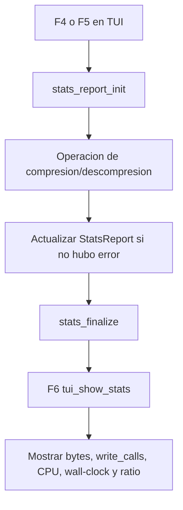

# Reporte de Profiling

Este documento resume que mide el proyecto, donde se capturan las metricas y como obtener evidencia de ingenieria durante ejecuciones de compresion y descompresion.

## Metricas implementadas

`StatsReport`, definido en `include/stats.h`, contiene:

| Metrica | Campo | Fuente |
| --- | --- | --- |
| Bytes originales procesados | `bytes_original` | Longitud acumulada de lineas comprimidas o bytes descomprimidos |
| Bytes comprimidos escritos | `bytes_compressed` | Total escrito por `WBuf` durante compresion |
| Bytes escritos a disco | `bytes_written` | Total escrito por `WBuf` |
| Llamadas a `write()` | `write_calls` | Incremento en `wbuf_push` y `wbuf_flush` |
| CPU usuario | `cpu_user_ms` | Diferencia de `getrusage().ru_utime` |
| CPU sistema | `cpu_sys_ms` | Diferencia de `getrusage().ru_stime` |
| Tiempo real | `wall_clock_ms` | Diferencia de `clock_gettime(CLOCK_MONOTONIC)` |
| Ratio de compresion | `compression_ratio` | `bytes_compressed / bytes_original` |

## Puntos de instrumentacion

### Compresion

En `compression_compress_file`:

1. Se toma tiempo inicial con `clock_gettime` y `getrusage`.
2. Se procesa el archivo linea por linea.
3. `WBuf` cuenta bytes escritos y llamadas reales a `write()`.
4. Al terminar sin error, se acumulan las metricas en `StatsReport`.
5. La TUI llama a `stats_finalize` para calcular el ratio.

### Descompresion

En `compression_decompress_file`:

1. Se toma tiempo inicial con `clock_gettime` y `getrusage`.
2. Se leen registros `[uint32_t frame_len][frame Zstd]`.
3. Se descomprime cada frame y se escribe con el mismo `WBuf` de 4096 bytes.
4. Al terminar sin error, se acumulan bytes originales, bytes escritos, llamadas `write()` y tiempos.
5. `bytes_compressed` no se actualiza en descompresion, por lo que el ratio puede quedar en `0.0` si solo se ejecuto F5.

## Flujo de visualizacion



## Comandos de evidencia

Compilar objetos:

```sh
make build
```

Compilar binario final con dependencias:

```sh
make build-with-deps
```

Ejecutar la aplicacion:

```sh
make run
```

Ejecutar con Valgrind:

```sh
make valgrind
```

## Procedimiento recomendado de medicion

1. Preparar un archivo de entrada en `data/`, por ejemplo `data/muestra.txt`.
2. Ejecutar `make run`.
3. Presionar F4 y escribir `muestra.txt` para generar `data/muestra.txt.zst`.
4. Presionar F6 y registrar los valores mostrados.
5. Presionar F5 y escribir `muestra.txt.zst` para generar `data/muestra.txt.zst.out`.
6. Presionar F6 y registrar los valores de descompresion.
7. Comparar el archivo original contra el `.out` con una herramienta externa si se requiere validar igualdad byte a byte.

## Interpretacion de resultados

| Senal | Interpretacion |
| --- | --- |
| `write_calls` bajo frente a `bytes_written` | El buffer de 4096 bytes esta reduciendo llamadas al sistema. |
| `cpu_sys_ms` alto | Puede indicar muchas llamadas al sistema o E/S lenta. |
| `cpu_user_ms` alto | Puede indicar costo de compresion/descompresion Zstd. |
| `wall_clock_ms` mucho mayor que CPU total | Puede indicar espera por disco, terminal o planificador. |
| `compression_ratio < 1.0` | El archivo comprimido ocupa menos que el original. |
| `compression_ratio > 1.0` | El formato comprimido crecio, usual en archivos pequenos o lineas cortas. |

## Limitaciones actuales

1. No hay pruebas automatizadas implementadas en el `Makefile`; `make test` solo informa que no existen pruebas todavia.
2. El profiling se registra en la ultima operacion exitosa, no en un historial acumulado por archivo.
3. La TUI muestra metricas en pantalla, pero no exporta un reporte a CSV o JSON.
4. El conteo de `write_calls` solo contempla escrituras hechas por `WBuf`, no escrituras internas de bibliotecas externas.
5. En descompresion no se registra `bytes_compressed`, por lo que el ratio no representa el tamano de entrada comprimida en esa ruta.
