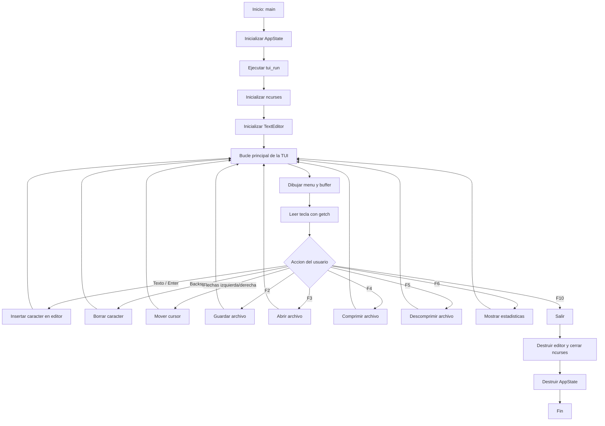

# Flujo de trabajo de la TUI

Este documento describe el flujo de ejecucion de la interfaz terminal del proyecto, basado en `src/main.c`, `src/tui.c`, `src/editor.c`, `src/file_io.c`, `src/compression.c` y `src/stats.c`.

## Resumen general



## Entrada de la aplicacion

1. `main` crea una variable `AppState state`.
2. `app_state_init` deja el estado inicial en cero: sin texto cargado, sin ruta actual y con `last_stats` inicializado.
3. `tui_run(&state)` toma el control de la interfaz.
4. Al volver de la TUI, `app_state_destroy` libera el estado y el programa termina con el codigo devuelto por `tui_run`.

## Inicializacion de la TUI

Dentro de `tui_run`:

1. Se inicializa ncurses con `initscr`.
2. Se activa modo raw con `raw`.
3. Se habilitan teclas especiales con `keypad(stdscr, TRUE)`.
4. Se desactiva el eco de teclado con `noecho`.
5. Se muestra el cursor con `curs_set(1)`.
6. Se crea un `TextEditor` con `editor_init`.
7. Si `state->text_buffer` ya contiene texto, se carga al editor con `editor_load_text`.

## Bucle principal

Mientras `running` sea verdadero, la TUI repite estos pasos:

1. Calcula cuantas filas visibles tiene el area de edicion.
2. Calcula la linea y columna del cursor a partir de `editor.cursor`.
3. Ajusta `scroll_top_line` para mantener visible el cursor.
4. Limpia la pantalla.
5. Dibuja la barra superior de acciones.
6. Dibuja el contenido del buffer del editor desde la linea visible actual.
7. Mueve el cursor a su posicion en pantalla.
8. Refresca la pantalla.
9. Lee una tecla con `getch`.
10. Ejecuta la accion asociada a esa tecla.

## Barra de acciones

La primera fila muestra este menu:

```text
F2: Guardar | F3: Abrir | F4: Comprimir | F5: Descomprimir | F6: Stats | F10: Salir
```

## Edicion de texto

El editor trabaja sobre un buffer en memoria (`TextEditor`).

Acciones soportadas:

1. Caracteres imprimibles ASCII (`32` a `126`): se insertan en la posicion actual con `editor_insert_char`.
2. `Enter`: inserta `\n`.
3. `Backspace`: elimina el caracter anterior con `editor_delete_char`.
4. Flecha izquierda: decrementa `editor.cursor` si no esta al inicio.
5. Flecha derecha: incrementa `editor.cursor` si no esta al final.

El editor mantiene:

1. `buffer`: contenido del texto.
2. `length`: cantidad de bytes usados.
3. `capacity`: memoria reservada.
4. `cursor`: posicion lineal dentro del buffer.

## F2: Guardar

Flujo:

1. La TUI pide un nombre con `prompt_input("Guardar como (en data/): ", ...)`.
2. Si el usuario ingreso texto, llama a `file_io_write_all(filepath, editor.buffer, editor.length)`.
3. `file_io_write_all` valida el nombre y lo convierte a una ruta dentro de `data/`.
4. Si `data/` no existe, lo crea.
5. Escribe todo el buffer en modo binario.
6. La TUI muestra `Archivo guardado` o `Error al guardar`.

Nota: para guardar, el usuario debe ingresar solo el nombre del archivo, por ejemplo `nota.txt`. No debe ingresar `data/nota.txt`, porque el modulo de E/S rechaza nombres con `/`.

## F3: Abrir

Flujo:

1. La TUI pide un nombre con `prompt_input("Abrir archivo (en data/): ", ...)`.
2. Si el usuario ingreso texto, llama a `file_io_read_all(filepath, &new_buf, &len)`.
3. `file_io_read_all` valida el nombre y lee desde `data/<nombre>`.
4. Si la lectura fue correcta, carga el contenido al editor con `editor_load_text`.
5. Libera el buffer temporal `new_buf`.
6. La TUI muestra `Archivo cargado` o `Error al abrir`.

Nota: igual que en guardar, el usuario debe ingresar solo el nombre, por ejemplo `nota.txt`.

## F4: Comprimir

Flujo:

1. La TUI pide el archivo con `prompt_input("Archivo a comprimir (en data/): ", ...)`.
2. `build_data_path` valida el nombre y construye la ruta de entrada.
3. Se acepta `archivo.txt` o `data/archivo.txt`; internamente se usa `data/archivo.txt`.
4. `append_suffix` crea la ruta de salida agregando `.zst`.
5. Se reinician las estadisticas con `stats_report_init(&state->last_stats)`.
6. Se ejecuta `compression_compress_file(input_path, outpath, &state->last_stats)`.
7. Si la compresion fue correcta, `stats_finalize` calcula el ratio.
8. La TUI muestra `Compresion exitosa` o `Error de compresion`.

Salida generada:

```text
data/<archivo>.zst
```

La compresion procesa el archivo linea por linea. Cada linea se comprime como un frame Zstd independiente y se escribe como:

```text
[uint32_t frame_len][bytes del frame Zstd]
```

La escritura usa un buffer interno de 4 KB antes de llamar a `write`.

## F5: Descomprimir

Flujo:

1. La TUI pide el archivo con `prompt_input("Archivo a descomprimir (en data/): ", ...)`.
2. `build_data_path` valida el nombre y construye la ruta de entrada.
3. Se acepta `archivo.zst` o `data/archivo.zst`; internamente se usa `data/archivo.zst`.
4. `append_suffix` crea la ruta de salida agregando `.out`.
5. Se reinician las estadisticas con `stats_report_init(&state->last_stats)`.
6. Se ejecuta `compression_decompress_file(input_path, outpath, &state->last_stats)`.
7. Si la descompresion fue correcta, `stats_finalize` recalcula el ratio.
8. La TUI muestra `Descompresion exitosa` o `Error de descompresion`.

Salida generada:

```text
data/<archivo>.out
```

La descompresion lee cada registro `[frame_len][frame]`, obtiene el tamano descomprimido del frame Zstd, descomprime y escribe el resultado con el buffer interno de 4 KB.

## F6: Estadisticas

Flujo:

1. La TUI llama a `tui_show_stats(state)`.
2. Se limpia la pantalla.
3. Se imprimen los campos de `state->last_stats`.
4. La pantalla queda bloqueada hasta que el usuario presione una tecla.
5. Luego vuelve al bucle principal.

Campos mostrados:

1. Bytes originales.
2. Bytes comprimidos.
3. Bytes escritos.
4. Llamadas a `write`.
5. CPU usuario en ms.
6. CPU sistema en ms.
7. Tiempo total en ms.
8. Ratio de compresion.

Las estadisticas visibles corresponden a la ultima compresion o descompresion ejecutada correctamente. Al iniciar la aplicacion, estan en cero.

## F10: Salir

Flujo:

1. Se cambia `running` a falso.
2. Termina el bucle principal.
3. Se libera el buffer del editor con `editor_destroy`.
4. Se libera el historial interno del editor con `editor_free_history`.
5. Se cierra ncurses con `endwin`.
6. `tui_run` retorna `0`.

## Reglas de rutas

La TUI restringe las rutas para evitar acceder fuera de `data/`.

Reglas principales:

1. No se aceptan nombres vacios.
2. No se acepta `..`.
3. No se aceptan separadores `/` ni `\\` en guardado y apertura.
4. Para compresion y descompresion, se permite escribir el prefijo `data/`, pero se normaliza internamente.
5. Los archivos guardados y abiertos siempre viven bajo `data/`.

## Mensajes al usuario

Las operaciones largas o de archivo terminan con un mensaje en la ultima linea. `show_message` muestra el texto y espera una tecla antes de limpiar la linea y volver al editor.

## Responsabilidades por modulo

1. `main.c`: crea y destruye el estado global de la aplicacion.
2. `app_state.c`: inicializa y limpia `AppState`.
3. `tui.c`: maneja ncurses, dibujo, teclado, prompts y pantalla de estadisticas.
4. `editor.c`: maneja el buffer de texto, insercion, borrado, carga y liberacion.
5. `file_io.c`: valida nombres, lee y escribe archivos dentro de `data/`.
6. `compression.c`: comprime, descomprime, escribe con buffer de 4 KB y acumula metricas.
7. `stats.c`: inicializa y finaliza las metricas compartidas.
